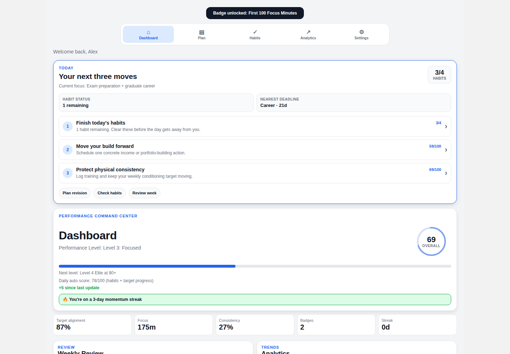

# Student Toolkit OS

[](https://github.com/PriceyLewis/StudentToolKit-OS-Demo/actions/workflows/quality.yml)

**Interactive portfolio demo · React Native · Expo Router · TypeScript · Local-first**



[Launch the live web demo](https://priceylewis.github.io/StudentToolKit-OS-Demo/) · [View the recruiter case study](https://priceylewis.github.io/projects/student-toolkit.html)

Student Toolkit OS is a cross-platform student performance and planning app that brings academics, habits, fitness, portfolio work and career progress into one coherent weekly system.

This repository is intentionally built as a **recruiter-friendly portfolio product** rather than a production SaaS. It demonstrates product design, state management, persistence, analytics, recoverability, testing and cross-platform mobile engineering without requiring an account or hosted backend.

## Try the interactive demo

```bash
npm install
npm run web
```

On the onboarding screen, choose **Try Interactive Demo**. The app loads a realistic sample week with goals, deadlines, habit history, analytics and revision data so the main experience can be evaluated immediately.

Demo mode is isolated from normal local data. If a local workspace already exists, Student Toolkit snapshots it before loading sample data and restores it when the demo is closed.

## Product highlights

- **Today command centre** — ranks the next three useful actions from habit progress and lower-scoring performance areas.
- **Adaptive revision scheduler** — distributes study time using exam runway, available study days, intensity and per-subject confidence.
- **Four performance areas** — academic, fitness, income/building and professional development.
- **Habit system** — weighted difficulty, completion history, streaks and weekly reset.
- **Weekly review and analytics** — rolling calendar windows, monthly insights and performance trends.
- **Focus timer** — persistent session state and focus-history metrics.
- **Local backup and restore** — validates imports, ignores unknown keys and rolls back if a restore write fails.
- **Interactive demo data** — realistic relative dates so the sample remains useful whenever the project is opened.
- **Responsive theming** — clean, dark and midnight dashboard modes.
- **Exports and reminders** — PDF planner export, JSON backup and local notification flows.

## Engineering decisions

### Local-first state

The app uses React Context for shared state and AsyncStorage for persistence. There is no production account service, payment flow or remote personal-data store in this portfolio build.

Habit writes use synchronous refs before React state updates so rapid interactions persist the newest snapshot rather than a potentially stale deferred state value.

### Recoverable data

Backup restore is treated as a transaction:

1. validate the backup envelope and recognised keys;
2. validate nested JSON values;
3. snapshot the current values;
4. apply removals and writes;
5. restore the previous snapshot if a write fails.

### Date-aware analytics

Analytics use actual local calendar windows rather than simply taking the last N array records. Duplicate records cannot inflate consistency and stale entries outside the requested date window are excluded.

### Maintainable dashboard

The dashboard is being decomposed into reusable presentation modules. The Today command centre and dashboard style system are now separate from the screen's orchestration logic, substantially reducing the size of the main route file.

## Quality checks

Run the same checks used by CI:

```bash
npm run check
```

This runs:

```bash
npm run lint
npm run typecheck
npm test
```

The zero-dependency Node test suite covers:

- revision-plan parsing, deadline handling and confidence weighting;
- exact calendar-window analytics;
- habit persistence across serialisation/restart and streak calculation;
- invalid backup values, unknown-key filtering and restore rollback.

GitHub Actions also verifies that the Expo web bundle can be exported successfully.

## Tech stack

| Area | Technology |
| --- | --- |
| App | React Native 0.81 + Expo 54 |
| Navigation | Expo Router |
| Language | TypeScript |
| State | React Context |
| Persistence | AsyncStorage |
| Charts | React Native Chart Kit |
| Notifications | Expo Notifications |
| Export | Expo Print + Sharing |
| Testing | Node test runner |
| CI | GitHub Actions |

## Project structure

```text
app/
  dashboard.tsx          screen orchestration and dashboard behavior
  dashboard.styles.ts    extracted dashboard presentation styles
  revision.tsx           adaptive revision scheduler
  gym.tsx                fitness planner
  hustle.tsx             build / income planner
  cv.tsx                 professional profile planner

components/
  dashboard/
    TodayCommandCenter.tsx
  PerformanceGraph.tsx

context/
  HabitContext.tsx
  PerformanceContext.tsx
  ProfileContext.tsx
  NotificationContext.tsx

src/
  screens/                analytics, habits and weekly review
  utils/
    backup.ts             device/file integration
    backupCore.js         validated transactional restore core
    demoData.ts           isolated portfolio demo state
    dateMetrics.js        calendar-window analytics helpers
    habitLogic.js         deterministic habit/streak logic
    revisionPlanner.js    adaptive scheduling engine

tests/                    zero-dependency regression tests
docs/                     architecture, demo and QA documentation
```

## Architecture

See [docs/architecture.md](./docs/architecture.md) for the data flow, persistence boundaries and feature architecture.

For a concise interview walkthrough, see [docs/demo-script.md](./docs/demo-script.md).

For the recommended screenshots and short portfolio video, see [docs/portfolio-capture-guide.md](./docs/portfolio-capture-guide.md).

## Web demo deployment

The repository now maintains a static Expo export on a dedicated `gh-pages` branch. See [docs/github-pages.md](./docs/github-pages.md) for the one-time Pages source setting and deployment URL.

Local development is unaffected because the repository subpath is applied only during the deployment build.

## Running on other targets

```bash
npm run android
npm run ios
npm run web
```

You can also start Expo directly:

```bash
npm start
```

## Portfolio scope

The current build deliberately avoids fake production infrastructure. It does not claim hosted authentication, cloud sync, subscriptions or server-side analytics that are not implemented.

Natural production extensions would be optional authenticated sync, calendar integration, a formal reusable design system and full device-level end-to-end coverage.

## License / use

No open-source licence is currently attached. The repository is published primarily for portfolio review.
