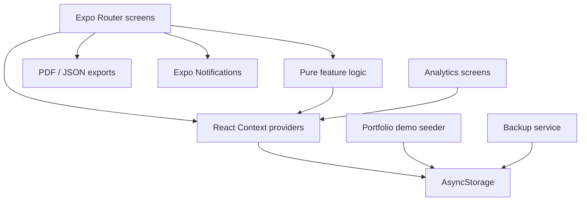

# Architecture

Student Toolkit OS is deliberately local-first. The architecture keeps product logic inspectable and avoids requiring a backend just to review the portfolio demo.

## System view



## Main layers

### Routes and presentation

The `app/` directory owns screen-level orchestration and navigation. Large presentation concerns are progressively extracted into reusable components. For example:

- `components/dashboard/TodayCommandCenter.tsx` renders the actionable daily summary.
- `app/dashboard.styles.ts` contains dashboard presentation styles separately from behavior.

### Shared state

React Context owns state that is used across feature areas:

- profile and onboarding state;
- performance scores, targets, deadlines and history;
- habits and completion history;
- local notification preferences;
- theme state.

Each provider rehydrates from AsyncStorage and exposes explicit mutation functions.

### Pure domain logic

Logic that can be evaluated without React Native APIs is isolated in `src/utils/`:

- `revisionPlanner.js` — deadline and confidence-weighted study planning;
- `dateMetrics.js` — local calendar windows and coverage;
- `habitLogic.js` — immutable completion updates and streaks;
- `backupCore.js` — import validation and rollback-safe restore transactions.

These modules have TypeScript declarations for the app and can be executed directly by Node's built-in test runner.

### Persistence

AsyncStorage is the source of durable local app state. Mutations are written deliberately rather than relying on an eventual screen unmount.

Habit state uses refs as the synchronous latest-value source so multiple rapid interactions cannot persist an earlier React state snapshot.

### Demo isolation

Portfolio demo mode has two layers:

1. the current recognised app keys are snapshotted;
2. normal app keys are cleared before sample data is seeded.

Resetting the demo writes a fresh sample without altering the saved pre-demo snapshot. Exiting restores the original values and removes demo metadata.

### Backup and restore

`backup.ts` handles file-system integration. `backupCore.js` handles the critical data rules.

Restore accepts only recognised app keys. Values must be strings or null, JSON-looking strings must themselves parse successfully, and unknown keys are ignored. Before applying an import, the existing local values are retained. If a storage write fails, the previous values are restored.

## Data flow example: completing a habit

```text
Tap habit
  → HabitContext.toggleHabit
  → pure immutable toggleHabitCompletion()
  → synchronous latest-value ref update
  → React state update
  → AsyncStorage persistence
  → dashboard / analytics re-render
```

## Data flow example: revision planning

```text
Subjects + deadline + weekly hours + available days + confidence
  → revisionPlanner.buildRevisionPlan()
  → urgency / confidence weighting
  → per-subject hours + sessions + readiness score
  → screen rendering
  → persisted planner inputs
  → optional PDF export
```

## Testing boundary

The regression suite deliberately tests the pure domain boundary. This catches logic regressions quickly without requiring a simulator for every commit. CI then runs lint, TypeScript validation and an Expo web export to verify integration/bundling.

Device-level end-to-end tests remain a production-oriented extension rather than something claimed by the current portfolio build.
